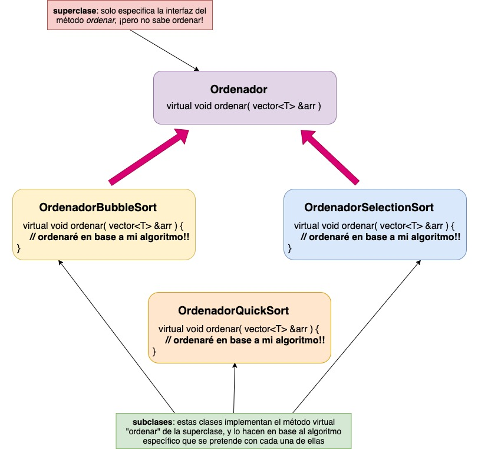

> en construcción

## Tabla de contenidos:

<!-- toc -->

## Introducción

Como comenté en **mi primer post sobre C++**: [utilizando tipos genéricos en C++](tipos-genericos-con-c++), como parte de mi proceso de formación como profesor de informática y programación **estoy tratando de aprender**, al menos de forma básica, **las entrañas del lenguaje C++**.

Para ello, y aprovechando para repasar también los distintos **algoritmos de ordenación** que existen (o, al menos, los más conocidos), me propuse crear en C++ una clase genérica que permitiera ordenar un array de datos (en este caso, utilizando la clase `vector`) de cualquier tipo (es decir, utilizando tipos genéricos) y utilizando, además, cualquiera de los distintos algoritmos de ordenación, pudiendo escogerlos incluso en tiempo de ejecución. Para esto último, aprovechamos los conceptos de **herencia y polimorfismo** que ofrece este lenguaje.

En este artículo **no comentaré cómo funciona la herencia en C++**, puesto que para ello ya dispones de un [artículo mucho más detallado que escribí acerca de este mismo concepto](tipos-genericos-con-c++).

## Herencia en C++

Explicaremos los **conceptos básicos de la herencia en C++** diseñando el esqueleto de nuestro programa que permitirá ordenar arrays de datos utilizando los diferentes algoritmos de ordenación que nosotros mismos programaremos.

Pero, para empezar, **¿qué es o qué permite la herencia?**

> Básicamente, la herencia, en cualquier lenguaje de programación, permite definir una clase (a la cual denominaremos **superclase**) con una serie de definiciones de métodos y atributos (en algunos casos dichos métodos podrían no estar implementados, y se les denomina **métodos virtuales en C++** o **abstractos en Java**). Después, podríamos definir una o diversas **clases que hereden de la superclase** (las **subclases**), y **adquirirían la estructura y comportamiento de la superclase** (esto es, sus atributos y métodos). Estas subcases deben implementar los métodos virtuales o abstractos, mientras que podrían simplemente utilizar o sobreescribir aquellos que sí disponen de una implementación en la superclase.

Podemos ver la herencia entre clases como una **jeraquía** de las mismas, siendo cada subclase una especialización de la clase padre. Esto podría verse, por ejemplo, con el ejemplo de los animales: tenemos, por un lado, los carnívoros (como el león) y los herbívoros (como el conejo). Además, los omnívoros pueden considerarse tanto carnívoros como herbívoros, y como ejemplo podemos poner al oso.


Lo mismo haremos con la jerarquía de clases de nuestros algoritmos de ordenación. Tendremos una clase base (la superclase), que será la clase `Ordenador`. Esta clase dispondrá de una definición del método `ordenar`, especificado como `virtual` ya que la clase genérica `Ordenador` no sabe cómo ordenar un array (serán las subclases específicas las que implementarán cada uno de los métodos de ordenación en base a algoritmos concretos). En este caso, las clases `OrdenadorBubbleSort`, `OrdenadorSelectionSort`, `OrdenadorInsertionSort`, `OrdenadorQuickSort` y `OrdenadorMergeSort`.



Vamos a hacerlo en C++:

```cpp
#include <iostream>
using namespace std;

template <typename T>
class Ordenador {

    public:
        /* Definimos el método como virtual.
        * Esto indicará al compilador que la implementación
        * dependerá de las subclases que extiendan de esta clase.
        * Lo igualamos a 0 para indicarle que este método no tiene 
        * implementación en esta clase
        */
        virtual void ordenar( vector<T> &arr ) = 0;

}

template <typename T>
class OrdenadorBubbleSort: public Ordenador<T> {

    public:
        void ordenar( vector<T> &arr ) {
            // aquí incluiremos la implementación concreta bubble sort
        }

}

template <typename T>
class OrdenadorInsertionSort: public Ordenador<T> {

    public:
        void ordenar( vector<T> &arr ) {
            // aquí incluiremos la implementación concreta insertion sort
        }

}

// ...

/* Haremos exactamente lo mismo que para OrdenadorBubbleSort
   y OrdenadorInsertionSort con todo el resto de clases específicas para ordenar * /
```

Como vemos, **para especificar que una clase hereda de otra** lo hacemos con la siguiente sintaxis:

```cpp
class MiSubclase: public MiSuperclase {
    // ...
}
```

El especificador de visibilidad, en este caso `public`, determina cómo expondrá la clase derivada (`MiSubclase`) los métodos y atributos derivados de la superclase (`MiSuperclase`). En este caso, los métodos públicos (`public`) de la superclase serán públicos en la subclase y los métodos protegidos (`protected`) serán, a su vez, protegidos. Los privados simplemente no pueden ser accedidos por una clase derivada de otra. Para más información: [herencia en C++ y especificadores de visibilidad](https://www.tutorialspoint.com/cplusplus/cpp_inheritance.htm)

## Algoritmos de ordenación

Una vez repasados los conceptos básicos de herencia y cómo la usaremos en este ejemplo, pasamos a explicar el funcionamiento de cada uno de los algoritmos de ordenación siguientes.

> **Disclaimer**: las siguientes implementaciones las he realizado yo mismo, y seguramente no sean ni las mejores, ni las más eficientes, ni quizá las más populares o reconocidas. Sin embargo, he intentado llegar a una implementación comprensible en cada uno de los algoritmos, y en todos los casos sin la utilización de arrays extra (memoria extra); esto es, se utiliza siempre el array recibido por parámetro y se mueven los elementos en ese mismo array sin la necesidad de emplear y crear en cada paso nuevos arrays de soporte.

### *Bubble sort*

**Explicación:**


**Implementación:**
```cpp
template <typename T>
class OrdenadorBurbuja: public Ordenador<T> {
    public:
        void ordenar( vector<T> &lista ){
            for( int i = 0; i < lista.size(); i++ ){
                for( int j = 1; j < lista.size() - i; j++ ){
                    if( lista[j] < lista[j-1] ){
                        T temp = lista[j];
                        lista[j] = lista[j-1];
                        lista[j-1] = temp;
                    }
                }
            }
        }
}
```

### *Selection sort*


### *Insertion sort*


### *Quick sort*


### *Merge sort*

## Polimorfismo