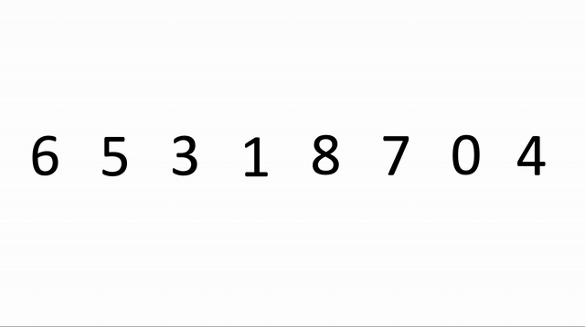

## Tabla de contenidos:

<!-- toc -->

## Introducción

Como comenté en **mi primer post sobre C++**: [utilizando tipos genéricos en C++](tipos-genericos-con-c++), como parte de mi proceso de formación como profesor de informática y programación **estoy tratando de aprender**, al menos de forma básica, **las entrañas del lenguaje C++**.

Para ello, y aprovechando para repasar también los distintos **algoritmos de ordenación** que existen (o, al menos, los más conocidos), me propuse crear en C++ una clase genérica que permitiera ordenar un array de datos (en este caso, utilizando la clase `vector`) de cualquier tipo (es decir, utilizando tipos genéricos) y utilizando, además, cualquiera de los distintos algoritmos de ordenación, pudiendo escogerlos incluso en tiempo de ejecución. Para esto último, aprovechamos los conceptos de **herencia y polimorfismo** que ofrece este lenguaje.

En este artículo **no comentaré cómo funciona genericidad en C++**, puesto que para ello ya dispones de un [artículo mucho más detallado que escribí acerca de este mismo concepto](tipos-genericos-con-c++).

## Herencia en C++

Explicaremos los **conceptos básicos de la herencia en C++** diseñando el esqueleto de nuestro programa que permitirá ordenar arrays de datos utilizando los diferentes algoritmos de ordenación que nosotros mismos programaremos.

Pero, para empezar, **¿qué es o qué permite la herencia?**

> Básicamente, la herencia, en cualquier lenguaje de programación, permite definir una clase (a la cual denominaremos **superclase**) con una serie de definiciones de métodos y atributos (en algunos casos dichos métodos podrían no estar implementados, y se les denomina **métodos virtuales en C++** o **abstractos en Java**). Después, podríamos definir una o diversas **clases que hereden de la superclase** (las **subclases**), y **adquirirían la estructura y comportamiento de la superclase** (esto es, sus atributos y métodos). Estas subcases deben implementar los métodos virtuales o abstractos, mientras que podrían simplemente utilizar o sobreescribir aquellos que sí disponen de una implementación en la superclase.

Podemos ver la herencia entre clases como una **jeraquía** de las mismas, siendo cada subclase una especialización de la clase padre. Esto podría verse, por ejemplo, con el ejemplo de los animales: tenemos, por un lado, los carnívoros (como el león) y los herbívoros (como el conejo). Además, los omnívoros pueden considerarse tanto carnívoros como herbívoros, y como ejemplo podemos poner al oso.


Lo mismo haremos con la jerarquía de clases de nuestros algoritmos de ordenación. Tendremos una clase base (la superclase), que será la clase `Ordenador`. Esta clase dispondrá de una definición del método `ordenar`, especificado como `virtual` ya que la clase genérica `Ordenador` no sabe cómo ordenar un array (serán las subclases específicas las que implementarán cada uno de los métodos de ordenación en base a algoritmos concretos). En este caso, las clases `OrdenadorBubbleSort`, `OrdenadorSelectionSort`, `OrdenadorInsertionSort`, `OrdenadorQuickSort` y `OrdenadorMergeSort`.


Vamos a hacerlo en C++ (he añadido un método para imprimir los elementos del array, lo cual nos permitirá hacer después las pruebas):

```cpp
#include <iostream>
using namespace std;

template <typename T>
class Ordenador {

    public:
        /* Definimos el método como virtual.
        * Esto indicará al compilador que la implementación
        * dependerá de las subclases que extiendan de esta clase.
        * Lo igualamos a 0 para indicarle que este método no tiene 
        * implementación en esta clase
        */
        virtual void ordenar( vector<T> &arr ) = 0;

        void imprimir( vector<T> &lista ){
            cout << "[";
            int i = 0;
            for( T elem: lista  ){
                cout << elem << ( i < lista.size() -1 ? ", " : "" );                
                i++;
            }
            cout << "]" << endl;
        }

}

template <typename T>
class OrdenadorBubbleSort: public Ordenador<T> {

    public:
        void ordenar( vector<T> &arr ) {
            // aquí incluiremos la implementación concreta bubble sort
        }

}

template <typename T>
class OrdenadorInsertionSort: public Ordenador<T> {

    public:
        void ordenar( vector<T> &arr ) {
            // aquí incluiremos la implementación concreta insertion sort
        }

}

// ...

/* Haremos exactamente lo mismo que para OrdenadorBubbleSort y OrdenadorInsertionSort con todo el resto de clases específicas para ordenar * /
```

Como vemos, **para especificar que una clase hereda de otra** lo hacemos con la siguiente sintaxis:

```cpp
class MiSubclase: public MiSuperclase {
    // ...
}
```

El especificador de visibilidad, en este caso `public`, determina cómo expondrá la clase derivada (`MiSubclase`) los métodos y atributos derivados de la superclase (`MiSuperclase`). En este caso, los métodos públicos (`public`) de la superclase serán públicos en la subclase y los métodos protegidos (`protected`) serán, a su vez, protegidos. Los privados simplemente no pueden ser accedidos por una clase derivada de otra. Para más información: [herencia en C++ y especificadores de visibilidad](https://www.tutorialspoint.com/cplusplus/cpp_inheritance.htm)

## Algoritmos de ordenación

Una vez repasados los conceptos básicos de herencia y cómo la usaremos en este ejemplo, pasamos a explicar el funcionamiento de cada uno de los algoritmos de ordenación siguientes.

> **Disclaimer**: las siguientes implementaciones las he realizado yo mismo, y seguramente no sean ni las mejores, ni las más eficientes, ni quizá las más populares o reconocidas. Sin embargo, he intentado llegar a una implementación comprensible en cada uno de los algoritmos, y en todos los casos sin la utilización de arrays extra (memoria extra); esto es, se utiliza siempre el array recibido por parámetro y se mueven los elementos en ese mismo array sin la necesidad de emplear y crear en cada paso nuevos arrays de soporte.

### *Bubble sort*

<u> **Explicación:** </u>

El algoritmo Bubble Sort, en castellano denominado **ordenamiento de burbuja**, consiste en recorrer el array que queramos ordenar "n" veces (siendo "n" el tamaño total de array), buscando en cada una de estas iteraciones el elemento máximo del array y colocándolo al final del mismo.

Para ello, se realizan comparaciones de un elemento (elemento "j") con el elemento anterior (elemento "j-1"), y si el elemento "j" es menor que el elemento "j-1" se intercambian. De esta forma, se consigue ir subiendo el elemento mayor del array hasta el final del mismo, al igual que las burbujas de aire intentan siempre subir hacia el techo de la habitación en la que se encuentran.

Se puede entender mucho mejor el algoritmo aprenciando la siguiente animación:


Fuente: [Wikipedia](https://es.wikipedia.org/wiki/Ordenamiento_de_burbuja)

Puesto que en cada iteración se debe volver a hacer una pasada al array, desde el principio hasta "n" - i (debido a que siempre se colocan al final del array los elementos mayores, y estos ya no debemos recorrerlos), la **complejidad computacional** de este algoritmo será de `O(n^2)`.

<u> **Implementación:** </u>

Como vemos, la implementación es sencilla, y se utiliza en todo momento el propio array para intercambiar los elementos, sin hacer uso de arrays extra que incrementen la memoria utilizada por el algoritmo.

```cpp
template <typename T>
class OrdenadorBubbleSort: public Ordenador<T> {
    public:
        void ordenar( vector<T> &lista ){
            for( int i = 0; i < lista.size(); i++ ){
                for( int j = 1; j < lista.size() - i; j++ ){
                    if( lista[j] < lista[j-1] ){
                        T temp = lista[j];
                        lista[j] = lista[j-1];
                        lista[j-1] = temp;
                    }
                }
            }
        }
}
```

### *Selection sort*

<u> **Explicación:** </u>

El algoritmo de ordenamiento Selection Sort, en castellano denominado **ordenamiento por selección**, consiste en recorrer, también, el array "n" veces, buscando en cada iteración el elemento menor. Cuando ha finalizado la iteración, se intercambia la primera posición no ordenada del array (primero será la 0, luego la 1, luego la 2...) por la posición del elemento menor que se haya encontrado.


Fuente: [Wikipedia](https://es.wikipedia.org/wiki/Ordenamiento_por_selecci%C3%B3n)

Puesto que en cada iteración se debe encontrar el menor elemento del array (y, por tanto, recorrerlo), el algoritmo tendrá también una **complejidad computacional** de `O(n^2)`.

<u> **Implementación:** </u>

La implementación es sencilla: una vez se ha acabado de recorrer el bucle interno que busca el menor elemento, se intercambia la posición de ese elemento por la primera posición no ordenada del array (siempre será "i", ya que el bucle interno siempre irá desde "i+1" hasta el final, ya que desde 0 hasta "i" será un subarray ya ordenado).

```cpp
template <typename T>
class OrdenadorSelectionSort: public Ordenador<T>{
    public:
        void ordenar( vector<T> &lista ){
            for( int i = 0; i < lista.size(); i++ ){
                int idx = i;
                for( int j = i+1; j < lista.size(); j++ ){
                    if( lista[j] < lista[idx] ){
                        idx = j;
                    }
                }
                T temp = lista[idx];
                lista[idx] = lista[i];
                lista[i] = temp;
            }
        }
};
```

### *Insertion sort*

<u> **Explicación:** </u>

El algoritmo Insertion Sort, en castellano **ordenamiento por inserción**, tiene la misma **complejidad computacional** que los anteriores (`O(n^2)`), sin embargo es quizá algo más complejo de entender e implementar.

Consiste en recorrer el array de "n" elementos, y para cada uno de estos elementos, se busca de nuevo desde el principio del array la posición que le corresponde (comparando dicho elemento, que digamos está en la posición "i", con todos sus elementos anteriores). En el momento en que se encuentre un elemento mayor que él, podemos deducir que esta es la posición que le corresponde (digamos "j"), y lo insertaremos aquí. A su vez, se deben desplazar a la derecha una posición todos los elementos que van detrás (es decir, desde "j" hasta "i-1").


Fuente: [Wikipedia](https://es.wikipedia.org/wiki/Ordenamiento_por_inserci%C3%B3n)

<u> **Implementación:** </u>

Quizá lo más "complicado" de la implementación de este algoritmo es el hecho de desplazar a la derecha todos los elementos que son mayores que el elemento que vamos a insertar en la posición "j". 

La comparación del elemento "i" la hacemos con el segundo bucle, recorriendo los elementos desde 0 hasta "i-1". En este bucle, cuando encontremos un elemento >= que el elemento que estamos comparando (posición "i"), sabemos que debemos insertarlo en la posición "j". Antes de esto, sin embargo, debemos desplazar a la derecha todos los elementos desde "j" hasta "i-1", y esto lo hacemos con un tercer bucle, que es el que se encarga de desplazar todos estos elementos. Después, simplemente colocamos el elemento en la posición "j".

```cpp
template <typename T>
class OrdenadorInsertionSort: public Ordenador<T>{
    public:
        void ordenar( vector<T> &lista ){
            for( int i = 0; i < lista.size(); i++ ){
                bool insertado = false;
                for( int j = 0; j < i && !insertado; j++ ){
                    if( lista[j] >= lista[i] ){ // Insertar "i" en la pos. de "j"
                        T temp = lista[i];
                        // Mover todos los elementos desde "j" hasta "i-1" una pos. a la derecha
                        for( int k = i; k >= j+1; k-- ){
                            lista[k] = lista[k-1];
                        }
                        // Reemplazamos el elemento
                        lista[j] = temp;
                        insertado = true;
                    }
                }
            }
        }
        
};
```

### *Quick sort*

<u> **Explicación:** </u>

Los **Quick Sort** y **Merge Sort** son los denominados **algoritmos rápidos de ordenación**, ya que son capaces de ordenar un array desordenado de elementos en **complejidad computacional de** `O(n^logn)` (al contrario de los anteriores que eran de `O(n^2)`).

Para poder lograr esta complejidad computacional, muy útil cuando debemos ordenar arrays de datos muy grandes (para los arrays pequeños la diferencia de coste es inapreciable), estos algoritmos se basan en la técnica de [**divide y vencerás**](https://es.wikipedia.org/wiki/Algoritmo_divide_y_vencer%C3%A1s).

> La técnica de **divide y vencerás** permite resolver problemas a través de la subdivisión de un problema en múltiples subproblemas más pequeños, consistiendo la solución al problema grande en la mezcla o unión de las soluciones paraciales obtenidas de la resolución de los subproblemas. Para ello, se utilizan, por lo general, **técnicas recursivas** para la implementación de los algoritmos, ya que permiten que una misma función sea reutilizada para la resolución tanto del problema general como de los subproblemas, que suelen ser instancias más pequeñas (más simples) del propio problema general.

En concreto, el **algoritmo de ordenación *Quick Sort*** consiste en aplicar los siguientes pasos:

1. Dado un array, escoger un elemento del mismo, al que denominaremos **pivote**. Existen [múltiples posibilidades a la hora de elegir el pivote](https://es.wikipedia.org/wiki/Quicksort#T%C3%A9cnicas_de_elecci%C3%B3n_del_pivote); en mi caso, voy a <u>escoger como pivote el elemento central</u> del array.
2. Una vez sabemos cual es el elemento pivote del array, debemos:
    - Colocar a la izquierda del pivote todos los elementos menores o iguales que él mismo.
    - Colocar a la derecha del pivote todos los elementos mayores que él mismo.
    
    Una vez completado este paso anterior, tendremos:
    - Un subarray a la izquierda, con todos los elementos menores o iguales que el pivote, pero **desordenados**.
    - Un subarray a la derecha, con todos los elementos mayores que el pivote, pero **desordenados**.
3. En el siguiente paso, simplemente debemos volver a **aplicar la misma técnica para el subarray izquierdo** (aquí es donde entra en juego la **recursividad**).
4. Aplicar la **misma técnica para el subarray derecho** (**recursividad**).
5. Debemos tener en cuenta que si un subarray consta de un único elemento, este subarray ya se considerará ordenado, por lo que dejaremos de llamar de forma recursiva al algoritmo en este punto. Este es el **caso trivial**, que nos sirve como caso de **fin de llamadas recursivas**.



A continuación dejo el video de youtube de la animación por si alguien necesita pararla poco a poco para entender el algoritmo:

<iframe width="560" height="315" src="https://www.youtube.com/embed/Y28K-lfhcWM" frameborder="0" allow="accelerometer; autoplay; encrypted-media; gyroscope; picture-in-picture" allowfullscreen></iframe>

Para entender en acción la anterior animación que muestra el funcionamiento del algoritmo, debemos tener en cuenta que:
1. Los elementos que se resaltan en **morado** son los que deben pasar al otro lado del pivote (son mayores o iguales que el pivote, dependiendo del lado en el que se encuentren).
2. Cuando se debe pasar un elemento al otro lado del pivote, se intercambia primero con el elemento justo a la izquierda o derecha del pivote (estos son los elementos resaltados en **naranja**).
3. A continuación, se intercambia el elemento morado (el que debe pasar al otro lado) con el pivote (elemento resaltado en **azul**). De esta forma se consigue pasar un elemento de un lado al otro del pivote utilizando siempre el mismo array (y sin tener que crear en cada iteración arrays adicionales de soporte).

<u> **Implementación:** </u>

La implementación del algoritmo anterior es la siguiente. Como vemos, creamos un método adicional en la clase `OrdenadorQuickSort`, que será la función recursiva a la que llamaremos cada vez que queramos aplicar quick sort sobre un subarray. Como podemos ver, para comenzar con el algoritmo, llamamos a esta función con el array completo (desde la posición 0 hasta la posición "n -1", siendo "n" el tamaño del array).

A continuación, simplemente pasamos los elementos menores o iguales que el pivote a su derecha, y los elementos mayores a su izquierda. Una vez completado esto, llamamos a la función de forma recursiva con el subarray izquierdo y derecho. Debemos tener en cuenta que la función no realizará ningún cálculo ni procesamiento si `posIni >= posFin` (esto es, si el subarray recibido tiene 0 o 1 elementos, en cuyo caso se considerará ya ordenado).

```cpp
template <typename T>
class OrdenadorQuicksort: public Ordenador<T>{
    void ordenar( vector<T> &lista ){
        ordenar( lista, 0, lista.size()-1 );
    }
    
    void ordenar( vector<T> &lista, int posIni, int posFin ){
        if( posIni < posFin ){
            int posPivote = (posIni+posFin)/2; // Cogemos el del medio
            int i = posIni, j = posFin;
            T pivote = lista[posPivote];

            // Si hay elementos a la derecha que sean menores o iguales que el pivote, insertarlos antes del pivote
            i = posPivote+1;
            while( i <= posFin ){
                if( lista[i] <= pivote ){
                    // Ponemos el elemento menor en la posición del pivote
                    lista[posPivote] = lista[i];
                    // Ponemos en la posición del elemento el elemento que tiene el pivote justo a la derecha
                    lista[i] = lista[posPivote+1];
                    // Ponemos el pivote 1 posición más a la derecha de la que tenía
                    lista[posPivote+1] = pivote;
                    posPivote++;
                }
                i++;
            }
            // Si hay elementos a la izquierda que sean mayores que el pivote, insertarlos después del pivote
            j = posPivote-1;
            while( j >= posIni ){
                if( lista[j] > pivote ){
                    // Ponemos el elemento mayor en la posición del pivote
                    lista[posPivote] = lista[j];
                    // Ponemos en la posición del elemento el elemento que tiene el pivote justo a la izquierda
                    lista[j] = lista[posPivote-1];
                    // Ponemos el pivote 1 posición más a la izquierda de la que tenía
                    lista[posPivote-1] = pivote;
                    posPivote--;
                }
                j--;
            }
            
            // Ordenamos el array izquierdo del pivote
            this->ordenar( lista, posIni, posPivote-1 );
            // Ordenamos el array derecho del pivote
            this->ordenar( lista, posPivote+1, posFin );
        }
        
    }
};
```

### *Merge sort*

<u> **Explicación:** </u>

Por último, el algoritmo de ordenación Merge Sort, en castellano denominado **ordenamiento por mezcla**, es, como Quick Sort, un algoritmo de ordenación rápido: la complejidad computacional del mismo es `O(n^logn)`.

> Sin embargo, en realidad, y **sin utilizar memoria extra**, la complejidad computacional del algoritmo para el peor caso es de `O(n^2)`, debido a la necesidad de recorrer el subarray derecho `n*n` veces para desplazar los elementos y recolocarlos si estos deben ser colocados en el subarray izquierdo, como veremos a continuación. En el caso en que lo resolviéramos utilizando memoria extra, con arrays adicionales, su complejidad sí que sería, aún para el peor caso, de `O(n^logn)`.

El algoritmo también se basa en la **técnica de divide y vencerás** para su resolución:
1. Se divide el array en dos subarrays, generalmente se parte el mismo por la mitad.
2. En este punto, se llama de nuevo a la función recursiva con ambos subarrays: se hace la **suposición** de que la función se encargará de ordenar cada una de las partes (la recursividad consiste, muchas veces, en suponer que la función hará cosas XD).
3. Una vez se tienen los dos subarrays ordenados, debemos proceder a **mezclarlos**. Para ello, se recorren los dos subarrays a la vez, y se van colocando, en orden, los elementos menores encontrados en uno u otro subarray, hasta que se han acabado de recorrer ambos subarrays.
4. ¿Cuál es, en este caso, el **caso base** o **caso trivial**? Pues, evidentemente, un subarray con 0 o 1 elementos ya se considerará ordenado, por lo que, cuando la función recursiva determine que el subarray recibido tiene 0 o 1 elementos, dejará de llamarse a sí misma.


Fuente: [Wikipedia](https://es.wikipedia.org/wiki/Ordenamiento_por_mezcla)

<u> **Implementación:** </u>

La implementación resulta bastante sencilla utilizando arrays extra de soporte, aunque tampoco es demasiado complicada realizando todas las operaciones sobre el mismo array inicial. 

Como con Quick Sort, creamos una función adicional en la clase, que será la función recursiva, y la llamamos inicialmente con el array entero. Esta función, primero deberá obtener la posición central, y llamarse a sí misma con los subarrays izquierdo y derecho, como se ha comentado antes.

A continuación, se deben mezclar los dos subarrays ya ordenados. Para ello, se recorren ambos a la vez, con las siguientes premisas:
- Si el elemento de la izquierda es menor o igual que el de la derecha, se deja este, y se avanza por la izquierda.
- Si el elemento de la derecha (subarray derecho) es menor, entonces es éste el que se debe colocar en la izquierda (subarray izquierdo). Se coloca en el subarray izquierdo, pero debemos colocar ahora el elemento que estaba en esta posición en el subarray derecho, en la posición que le corresponda. Para ello, recorremos el subarray derecho, buscando la posición correspondiente, y desplazando los elementos 1 posición a la izquierda hasta que se encuentra la posición del elemento. En este punto, habremos colocado el elemento correspondiente en la izquierda, y seguiremos teniendo el subarray derecho ordenado.

```cpp
template <typename T>
class OrdenadorMergeSort: public Ordenador<T>{
    
    void ordenar( vector<T> &lista ){
        this->ordenar( lista, 0, lista.size()-1 );
    }
    
    void ordenar( vector<T> &lista, int posIni, int posFin ){
        if( posIni < posFin ){
            // Ordenamos la parte izq. y derecha del array
            int posCentral = (posIni+posFin)/2;
            this->ordenar( lista, posIni, posCentral );
            this->ordenar( lista, posCentral+1, posFin );
            
            // Mezclamos
            int i = posIni, j = posCentral+1;
            while( i <= posCentral && j <= posFin ){
                // Cuando en la derecha haya un elemento menor, lo colocamos en la parte izq.
                // Y recolocamos el elemento de la izq. donde le corresponda en la derecha
                if( lista[j] < lista[i] ){
                    // Colocamos el elemento de la derecha en la posición correspondiente de la izq.
                    T temp = lista[i];
                    lista[i] = lista[j];
                    // Buscamos la posición que le corresponde al elemento de la izq. en la derecha
                    // Este bucle es el que nos lleva a complejidad O(n^2) para el peor caso
                    int k = j;
                    for(; k <= posFin; k++ ){
                        if( temp > lista[k] ){
                            lista[k] = lista[k+1];
                        } else{
                            break;
                        }
                    }
                    lista[k-1] = temp;
                }
                i++;
            }
        }
    }
    
};
```

> **Nota**: puede que me anime y publique también la versión real `O(n^logn)` de Merge Sort utilizando arrays extra, para ver la diferencia entre ambos.

## Polimorfismo

Por último, vamos a ver cómo podemos **utilizar el polimorfismo en C++** para poder **utilizar, indistintamente, un algoritmo de ordenación u otro gracias a la jerarquía de herencia** que hemos creado previamente.

> El **polimorfismo** es la capacidad que tiene un lenguaje de programación para permitir utilizar objetos (y, por ende, sus métodos y atributos) que podrían esconder, en realidad, un tipo diferente.

Esto permite que una función pueda recibir por parámetro un objeto de un tipo (por ejemplo, la superclase `Ordenador`) y ejecutar un método definido en esa clase. Sin embargo, gracias al polimorfismo, el **tipo específico de `Ordenador`** podría ser `OrdenadorBubbleSort`, `OrdenadorInsertionSort`, `OrdenadorMergeSort`... y, por tanto, la implementación del método (que está disponible en todos ellos por ser subclases de `Ordenador`) permitirá que, **según el tipo del objeto concreto y en tiempo de ejecución** ([late binding](https://en.wikipedia.org/wiki/Late_binding)), se ejecute una u otra implementación del método.

Lo podemos ver en el siguiente ejemplo concreto:

```cpp
void ordenarArrayEnteros( Ordenador<int>* ordenador, vector<int> &vec ){
    ordenador->ordenar(vec);
}

int main() {
   Ordenador<int> *ord;
   
   cout << "Array DESORDENADO" << endl << "-------------------" << endl;
   vector<int> array {3, 1, 5, 10, 12, 4, 7, 20, 16, 0, 2, 1};
   ord->imprimir(array);

   OrdenadorBurbuja<int> burb;
   OrdenadorSeleccion<int> selec;
   OrdenadorInsercion<int> inser;
   OrdenadorQuicksort<int> quicksort;
   OrdenadorMergeSort<int> mergesort;
   
   cout << "¿Con que algoritmo quieres ordenar el array?" << endl;
   cout << "1. BubbleSort" << endl;
   cout << "2. SelectionSort" << endl;
   cout << "3. InsertionSort" << endl;
   cout << "4. QuickSort" << endl;
   cout << "5. MergeSort" << endl;
   cout << "----------------" << endl;
   cout << "Introduce una opción: ";
   int opt;
   cin >> opt;
   
   switch(opt){
       case 1:
           ord = &burb;
           break;
       case 2:
           ord = &selec;
           break;
       case 3:
           ord = &inser;
           break;
       case 4:
           ord = &quicksort;
           break;
       case 5:
           ord = &mergesort;
   }
   
   ordenarArrayEnteros(ord, array);
   
   cout << "Array ORDENADO" << endl << "-------------------" << endl;
   ord->imprimir(array);
   
   return 0;
}
```

Como vemos, la utilización es sencilla. Definimos una función, `ordenarArrayEnteros`, que recibe por parámetro el objeto ordenador (como vemos, de tipo `Ordenador`) y el array que ordenará. Aquí podemos ver claramente que esta función no tiene ni idea de cómo se ordenará el array: simplemente, utiliza la interfaz de la función `ordenar` de la clase `Ordenador`.

Por otro lado, definimos un objeto **puntero** de tipo `Ordenador`, y será este puntero el que modifiquemos según el algoritmo que decidamos que queremos utilizar para ordenar: apuntará a un objeto específico u otro, de tipo `OrdenadorSelectionSort`, `OrdenadorQuickSort`, etc., al que se apuntará en tiempo de ejecución.

Ejemplo:

```
Array DESORDENADO
-------------------
[3, 1, 5, 10, 12, 4, 7, 20, 16, 0, 2, 1]
¿Con que algoritmo quieres ordenar el array?
1. BubbleSort
2. SelectionSort
3. InsertionSort
4. QuickSort
5. MergeSort
----------------
Introduce una opción: 5
Array ORDENADO
-------------------
[0, 1, 1, 2, 3, 4, 5, 7, 10, 12, 16, 20]
```

## Conclusión

Uff, un artículo un poco largo, que me ha costado bastantes horas escribir y preparar, sobre todo la animación del funcionamiento de Quick Sort, ya que de las existentes no me agradaba ninguna, porque la mayoría utilizan como elemento pivote el primer elemento de la lista, o suponen la utilización de arrays extra para mover los elementos.

Sin embargo, he aprendido y practicado muchos conceptos mientras redactaba el post, y espero que le pueda servir de ayuda a alguien en el futuro.

Muy buenos días o noches,

***David***.